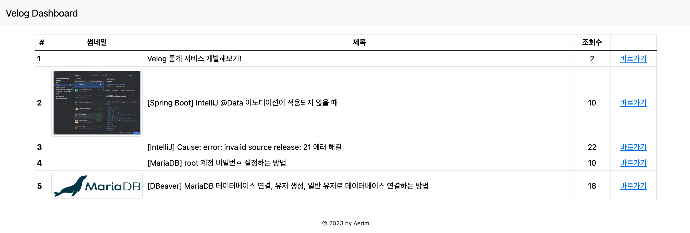
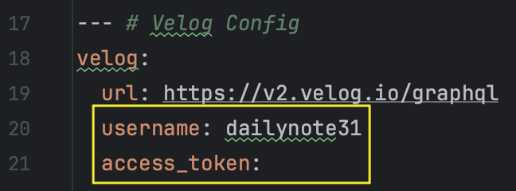

# velog_dashboard

Velog의 통계를 한눈에 확인할 수 있는 서비스

 

### 사용 방법
1. [application.yml](./src/main/resources/application.yml) 파일에서 Velog Config 부분을 수정한다.

   

    - username : Velog 아이디
    - access_token : Velog 액세스 토큰 
       - 확인 방법 : F12 > Application > Storage > Cookies > https://velog.io > access_token